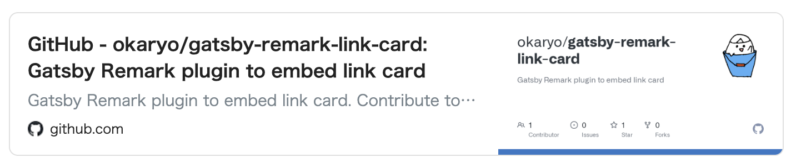

## @okaryo/gatsby-remark-link-card
Gatsby Remark plugin to embed link card to your markdown.

This plugin allows you to display links as link cards in Markdown without the need for any special syntax.

### Sample


### Installation
```sh
npm install @okaryo/gatsby-remark-link-card
```

### How to use
#### in Config
```js
// In your gatsby-config.js
plugins: [
  {
    resolve: `gatsby-transformer-remark`,
    options: {
      plugins: [
        `@okaryo/gatsby-remark-link-card`
      ]
    }
  }
];
```
#### in Markdown
Only the links that are formatted as a paragraph and surrounded by empty lines will be displayed as link cards.

```md
✅
(empty line)
https://github.com/okaryo/gatsby-remark-link-card
(empty line)

✅
## Header
https://github.com/okaryo/gatsby-remark-link-card

❌
text
https://github.com/okaryo/gatsby-remark-link-card

❌
(empty line)
[link text](https://github.com/okaryo/gatsby-remark-link-card)
(empty line)

❌
(empty line)
* https://github.com/okaryo/gatsby-remark-link-card
(empty line)
```

### Customization
You can apply custom styles to the classes specified within the link card to customize its appearance.

```css
.gatsby-remark-link-card__container {}

.gatsby-remark-link-card__link {}

.gatsby-remark-link-card__main {}

.gatsby-remark-link-card__content {}

.gatsby-remark-link-card__title {}

.gatsby-remark-link-card__description {}

.gatsby-remark-link-card__meta {}

.gatsby-remark-link-card__favicon {}

.gatsby-remark-link-card__url {}

.gatsby-remark-link-card__thumbnail {}
```
